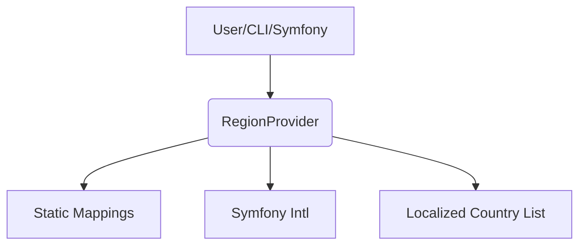

# 🏛️ Architecture Overview: Ydee Intl Region

This document describes the high-level structure and data flow of the project.

---

## Main Components

- **RegionProvider**: Core class for region-based country filtering.
- **Static Mappings**: UN M49 continent and subregion data.
- **Symfony Bundle**: Provides DI and CLI integration.
- **Console Command**: CLI for listing countries by region.
- **Tests**: PHPUnit tests for all features.

---

## Data Flow

---

## File Structure (Simplified)

- `src/`
  - `RegionProvider.php`
  - `Mapping/`
  - `Bundle/`
  - `Command/`
- `tests/`
- `docs/`

---

## Extending
- Add new mappings in `src/Mapping/`.
- Add new CLI commands in `src/Command/`.
- Add new services in `src/Bundle/`.

---

See `README.md` and `docs/FULLSCOPE.md` for more details. 