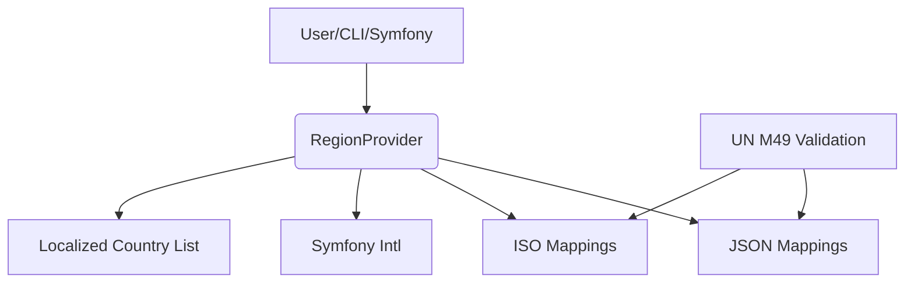

# 🏛️ Architecture Overview: Ydee Intl Region

This document describes the high-level structure and data flow of the project.

---

## Main Components

- **RegionProvider**: Core class for region-based country filtering.
- **JSON Mappings**: UN M49 continent and subregion data stored in JSON files.
- **ISO Mappings**: Conversion between ISO codes and UN M49 codes.
- **Symfony Bundle**: Provides DI and CLI integration.
- **Console Command**: CLI for listing countries by region.
- **Tests**: PHPUnit tests for all features with UN M49 validation.

---

## Data Flow

---

## File Structure

- `src/`
  - `RegionProvider.php` - Main service class
  - `Mapping/`
    - `ContinentMapping.php` - Continent data loader
    - `SubregionMapping.php` - Subregion data loader
  - `DependencyInjection/`
    - `IntlRegionExtension.php` - Bundle configuration
    - `Configuration.php` - Configuration schema
  - `Command/`
    - `ListRegionsCommand.php` - CLI command
  - `Resources/config/services.yaml` - Service definitions
- `data/mapping/`
  - `continent.json` - Continent mappings
  - `subregion.json` - Subregion mappings
  - `iso-mappings.json` - ISO code conversions
- `tests/`
  - `RegionProviderTest.php` - Main service tests
  - `Mapping/` - Mapping class tests
  - `Command/` - CLI command tests
  - `UNM49DataValidationTest.php` - UN data validation
- `scripts/`
  - `download-un-m49-data.php` - UN data downloader
  - `update-mappings.php` - Mapping updater

---

## Data Architecture

### JSON Mapping Files

The library uses JSON files for data storage:

1. **`continent.json`**: Maps country codes to continent codes
2. **`subregion.json`**: Maps country codes to subregion codes  
3. **`iso-mappings.json`**: Converts between ISO and UN M49 codes

### Caching Strategy

- Static caching in mapping classes for performance
- Lazy loading of JSON data
- Memory-efficient data structures

### Error Handling

- PSR-3 logging for all operations
- Graceful fallbacks for missing translations
- Comprehensive error reporting

---

## Extending

- Add new mappings in `data/mapping/` JSON files
- Add new CLI commands in `src/Command/`
- Add new services in `src/DependencyInjection/`
- Update validation in `tests/UNM49DataValidationTest.php`

---

## Performance Considerations

- JSON files are loaded once and cached
- Static methods for efficient data access
- Minimal memory footprint
- Fast country code lookups

---

See `README.md` and `docs/FULLSCOPE.md` for more details. 