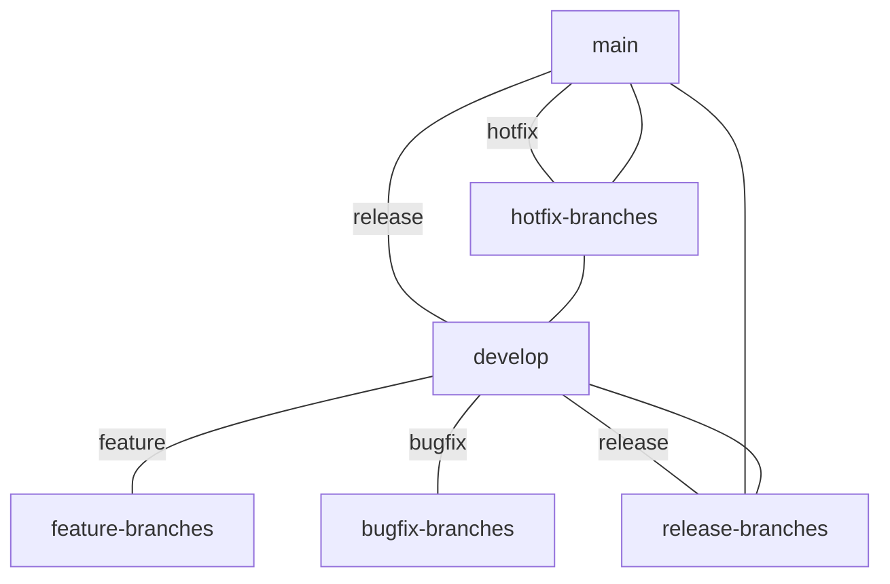

# 🚦 Branching Strategy for Ydee Intl Region

This project follows a clear branching strategy to ensure stability, collaboration, and efficient delivery.

---

## Main Branches

- **main**: Always production-ready. Only stable, released code lives here.
- **develop**: Integration branch for features and fixes. All development work merges here before going to main.

---

## Supporting Branches

### Feature Branches
- **Prefix:** `feature/ITR-XXXX-description`
- **Purpose:** New features, enhancements, or user stories.
- **Base:** `develop`
- **Example:** `feature/ITR-0003-region-provider`

### Bugfix Branches
- **Prefix:** `bugfix/ITR-XXXX-description`
- **Purpose:** Non-critical bug fixes.
- **Base:** `develop`
- **Example:** `bugfix/ITR-0007-localization`

### Hotfix Branches
- **Prefix:** `hotfix/description`
- **Purpose:** Critical fixes for production.
- **Base:** `main`
- **Example:** `hotfix/cli-crash`

### Release Branches
- **Prefix:** `release/x.y.z`
- **Purpose:** Prepare for a new production release (final testing, version bump, docs).
- **Base:** `develop`, merged into `main` and `develop` after release.
- **Example:** `release/1.0.0`

---

## Workflow

1. **Start from `develop`** for features and bugfixes.
2. **Create a branch** with the appropriate prefix and ticket number.
3. **Open a Pull Request** to merge into `develop` (or `main` for hotfixes).
4. **Code review and CI** must pass before merging.
5. **Release:** Create a `release/x.y.z` branch, finalize, then merge to `main` and tag.
6. **Hotfixes:** Branch from `main`, merge back to both `main` and `develop`.

---

## Naming Conventions
- Use lowercase, hyphens for spaces.
- Always include the user story or ticket number if applicable.

---

## Diagram

---

**Stick to this strategy for a clean, collaborative repo!** 